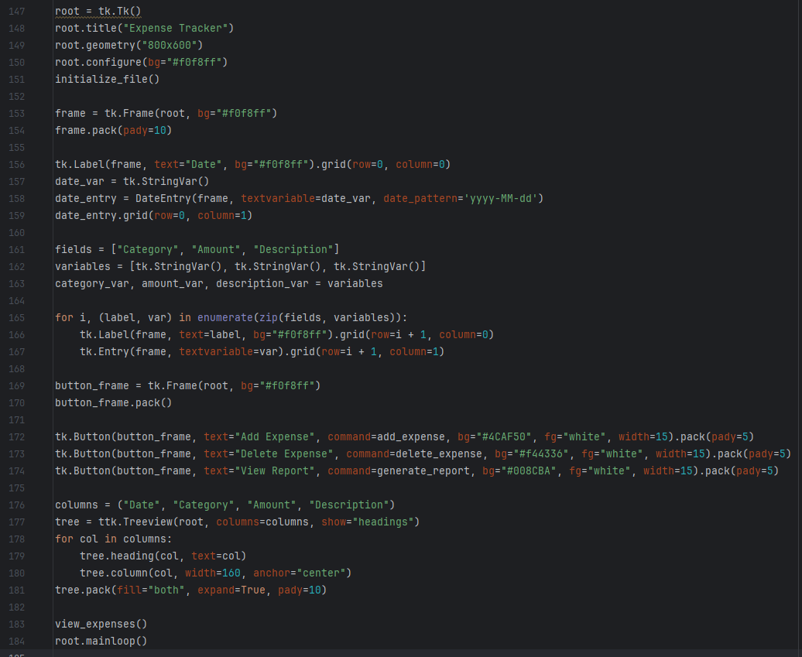
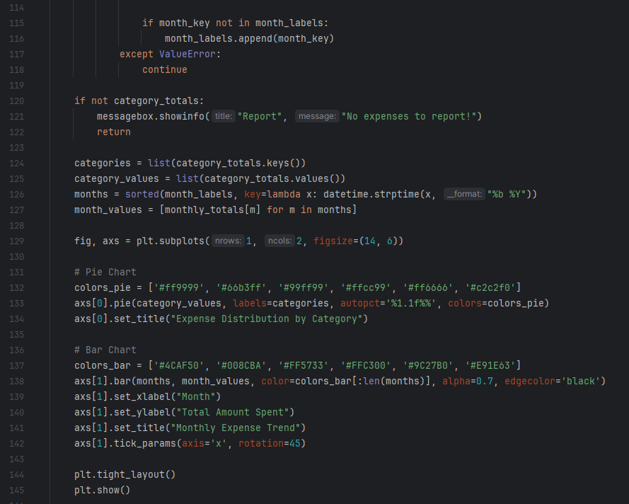
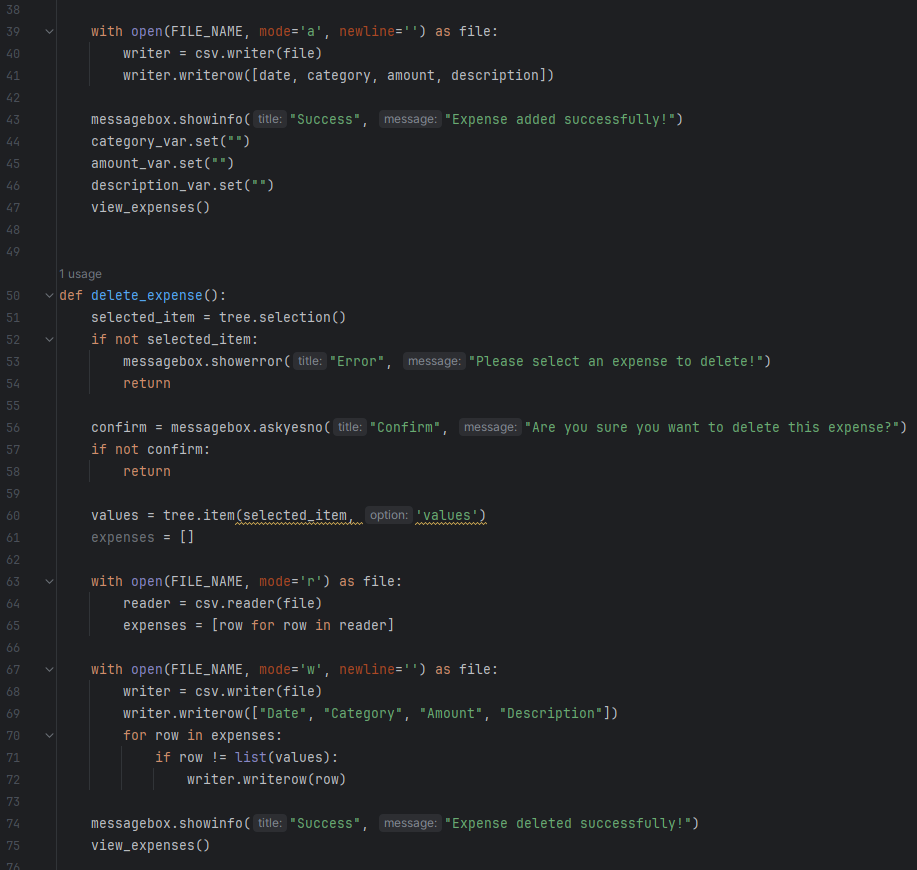
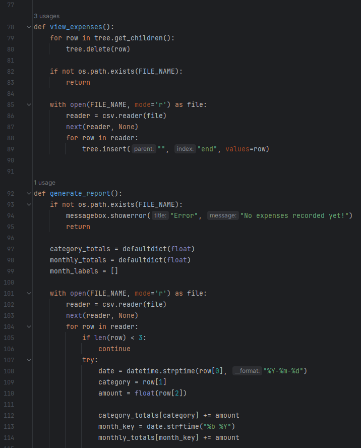
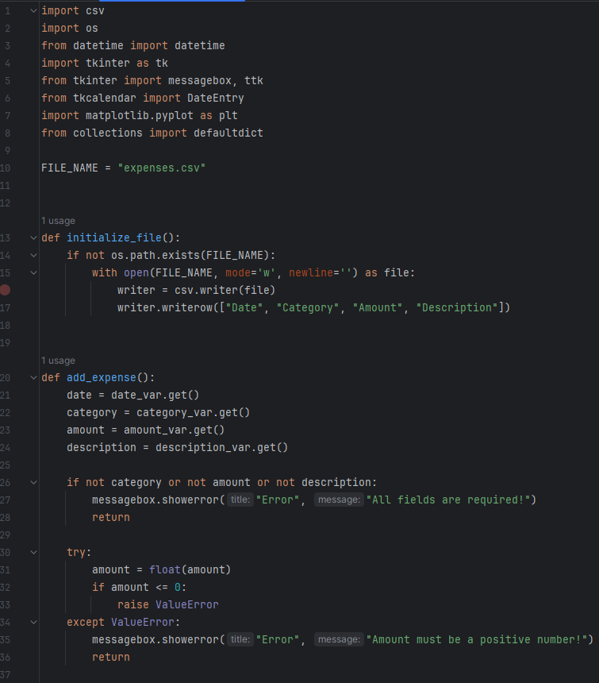

<div align="center">

# 💸 Advanced Expense Tracker Application

> A feature-rich, desktop expense manager built with Python and Tkinter, featuring local CSV persistence, calendar date selection, and side-by-side analytical reports (Pie and Bar charts) using Matplotlib.

🎬 **Watch the Demo Video — Expense Tracker:** [Google Drive Demo Video](https://drive.google.com/file/d/1zEbzQEub6u-akqyOxdk-OpMoGQjq_NmD/view?usp=drive_link)

[](https://www.python.org/)
[](https://docs.python.org/3/library/tkinter.html)
[](https://matplotlib.org/)
[](https://docs.python.org/3/library/csv.html)
[](LICENSE)

</div>

---

## 🌟 Overview

The **Advanced Expense Tracker** is a complete, functional desktop utility application developed. It helps users take control of their personal finance by logging daily expenditures, storing data locally, and displaying spending breakdowns.

The application utilizes **CSV files** as a lightweight, serverless database to persist records. It integrates `tkcalendar.DateEntry` to prevent invalid formatting errors on date inputs. The key analytical highlight is the **Visual Report Engine**, which loads raw data from the CSV, aggregates it using a `defaultdict`, and renders a side-by-side **Pie Chart** (percentage distribution by category) and a **Bar Chart** (monthly spending trends) in a unified Matplotlib canvas.

---

## 📸 Screenshots

### 1. Dual Matplotlib Analytics Board (Pie & Bar charts)
<p align="center">
  
</p>

### 2. Adding Expenses & Calendar Dropdown Active
<p align="center">
   &nbsp;&nbsp;
  
</p>

### 3. Input Validation & Confirmation Prompts
<p align="center">
   &nbsp;&nbsp;
  
</p>

---

## ✨ Features

- **🗃️ Local CSV Database**: Stores transactions locally in `expenses.csv` with columns: `Date`, `Category`, `Amount`, and `Description`. Automatically initializes the file with headers if it does not exist.
- **📅 Calendar Picker Integration**: Integrates `tkcalendar.DateEntry` to display an interactive dropdown calendar, enforcing clean, ISO-standard `yyyy-MM-dd` date formatting automatically.
- **📊 Matplotlib Report Engine**: Generates a unified dual-chart dashboard:
  - **Pie Chart (Left)**: Renders percentage distribution of spending grouped by category.
  - **Bar Chart (Right)**: Shows monthly expense trends and total amounts spent across months chronologically.
- **🛠️ CRUD Operations**:
  - **Add**: Validates fields, appends record to the CSV, clears fields, and updates the Treeview.
  - **Delete**: Prompts the user with a confirmation dialog, removes the selected row from the CSV, and refreshes the data grid.
  - **View**: Loads all entries sequentially from the CSV and populates them into the table.
- **🛡️ Positive Input Validation**:
  - Guards against empty fields with warning prompts.
  - Validates that amounts are numeric and positive (non-zero/non-negative values).

---

## 🛠️ Tech Stack & Dependencies

| Component | Technology | Description |
| :--- | :--- | :--- |
| **Language** | Python 3.8+ | Core application code |
| **GUI Framework** | `tkinter` & `tkinter.ttk` | Layout, entry fields, and Treeview table grids |
| **Calendar Widget**| `tkcalendar` (DateEntry) | Visual dropdown calendar UI widget |
| **Data Viz** | `matplotlib.pyplot` | Renders the analytical subplots (Pie + Bar charts) |
| **File I/O** | `csv` (Standard Library) | Writes to and reads from local spreadsheets |
| **Data Aggregation**| `collections.defaultdict` | Groups expenditures by category and months |

---

## 📁 Project Structure

```
Expense-Tracker-Application/
│
├── ExpenseTracker.py      # Main application script — GUI, CSV File I/O, Matplotlib canvas
├── expenses.csv           # Local CSV spreadsheet storing user expense data
├── Expense Tracker Report.docx # Basic project documentation
├── screenshots/
│   ├── screenshot_1.png   # Matplotlib dual data visualization plots
│   ├── screenshot_2.png   # Main window showing populated Treeview
│   ├── screenshot_3.png   # Main window overview
│   ├── screenshot_4.png   # Calendar dropdown editor interface
│   ├── screenshot_5.png   # Required fields validation dialog
│   ├── screenshot_6.png   # Confirm deletion alert messagebox
│   └── screenshot_7-18.png # Additional workflow logs and alert messages
└── README.md
```

---

## ⚙️ How It Works

```
User launches application
          ↓
initialize_file() runs → Creates expenses.csv with headers if missing
          ↓
view_expenses() parses CSV → populates the ttk.Treeview data grid
          ↓
User adds an expense:
  - Selects date via DateEntry (calendar)
  - Enters Category, positive Amount, and Description
  - Clicks [Add Expense]
  - Validations run → Append to CSV → Clear Inputs → Reload Treeview
          ↓
User views reports:
  - Clicks [View Report]
  - defaultdict groups amounts by category & month
  - Matplotlib opens plt.subplots(1, 2) showing Pie and Bar charts
```

---

## 🚀 Getting Started

### Prerequisites
- **Python 3.8** or higher
- **Pillow** (PIL for window icons)
- **Matplotlib** (for rendering charts)
- **tkcalendar** (for date picker support)

---

### Setup Instructions

**1. Clone the Repository:**
```bash
git clone https://github.com/AnasQ2003/Expense-Tracker-Application.git
cd Expense-Tracker-Application
```

**2. Install Dependencies:**
```bash
pip install matplotlib tkcalendar pillow
```

**3. Run the Expense Tracker:**
```bash
python ExpenseTracker.py
```

The application window will open immediately, auto-generating an `expenses.csv` template database.

---

## 💡 Key Concepts Demonstrated

| Concept | How It's Used |
| :--- | :--- |
| **Treeview Grid Selection**| `tree.selection()` extracts values from selected rows for targeted deletions |
| **Default Dictionaries** | `defaultdict(float)` automates grouping sums without key-checking |
| **Subplots Canvas** | `plt.subplots(1, 2, figsize=(14, 6))` fits two distinct charts on one window |
| **Chronological Sorting** | Lamda function sorts month keys by date: `key=lambda x: datetime.strptime(x, "%b %Y")` |
| **CSV Row Overwriting** | Re-writes CSV from lists when deleting rows to maintain database consistency |
| **Calendar Formatting** | `date_pattern='yyyy-MM-dd'` binds dates in standardized formats |

---

## 🧠 Learning Objectives

> ✅ **Objective**: Build a real-world, complete utility application that integrates data science visualizers (Matplotlib) with local storage structures (CSV File I/O) and advanced widget controls (calendar date pickers).

**Activities Completed:**
- ✔️ Used Python `csv` package to write, read, and rewrite flat-file databases.
- ✔️ Implemented selection-based CRUD handling using Treeview nodes.
- ✔️ Leveraged collections data containers (`defaultdict`) to group and sum expenditures.
- ✔️ Integrated `matplotlib` plot canvases showing pie and bar charts side-by-side.
- ✔️ Used custom pip-installed widgets (`tkcalendar`) to enforce strict input data constraints.

**Key Takeaways:**
- Flat files (like CSVs) serve as ideal, lightweight local data stores for desktop tools.
- Data visualization (Matplotlib) adds massive business value to simple tracking applications.
- Synchronizing in-memory models, local storage, and active UI tree views is essential for state consistency.
- Standard libraries combined with key external packages (Pillow, tkcalendar) result in consumer-ready desktop products.

---

## 📄 License

```
MIT License

Copyright (c) Expense Tracker Application --- 2026 AnasQ2003

Permission is hereby granted, free of charge, to any person obtaining a copy
of this software and associated documentation files (the "Software"), to deal
in the Software without restriction, including without limitation the rights
to use, copy, modify, merge, publish, distribute, sublicense, and/or sell
copies of the Software, and to permit persons to whom the Software is
furnished to do so, subject to the following conditions:

The above copyright notice and this permission notice shall be included in all
copies or substantial portions of the Software.

THE SOFTWARE IS PROVIDED "AS IS", WITHOUT WARRANTY OF ANY KIND, EXPRESS OR
IMPLIED, INCLUDING BUT NOT LIMITED TO THE WARRANTIES OF MERCHANTABILITY,
FITNESS FOR A PARTICULAR PURPOSE AND NONINFRINGEMENT.
```

---

## 👨‍💻 Author

**Anas Ahmed Qureshi.** — [@AnasQ2003](https://github.com/AnasQ2003)

---

<div align="center">
  <p>Built with ❤️ by <strong>Anas</strong></p>
  
 <div align="center">

Made with a lot of ☕

**⭐ If you found this useful, please star the repository!**

</div>
